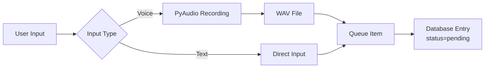
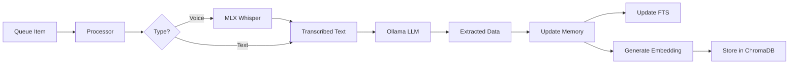

# Second Brain - Technical Documentation

## Overview

Second Brain is a local-first memory augmentation system that captures thoughts via voice/text, processes them with LLMs to extract structured information, and provides intelligent retrieval through various interfaces.

## Current Implementation Status

### ✅ Completed Features

1. **Voice Capture** - PyAudio-based recording with silence detection
2. **Transcription** - MLX Whisper for GPU-accelerated transcription on Apple Silicon
3. **LLM Extraction** - Ollama integration for structured data extraction
4. **Queue System** - File-based queue for reliable async processing
5. **Database** - SQLite with FTS5 for full-text search
6. **Vector Storage** - ChromaDB for semantic search with embeddings
7. **Dual Search** - Keyword (FTS5) and semantic (vector) search modes
8. **CLI** - Rich terminal interface with lazy loading optimization

### 🔧 Key Technical Decisions

- **MLX over OpenAI Whisper**: MLX provides GPU acceleration on Apple Silicon (~1s for large model)
- **Manual FTS Management**: Removed SQLite triggers due to "database disk image is malformed" errors with special characters
- **Shared Database Instance**: Single connection shared across components to avoid locking issues
- **Retry Logic**: Exponential backoff for database operations to handle concurrent access
- **ChromaDB over SQLite-VSS**: Better performance for complex operations like finding 100 nearest neighbors
- **Lazy Loading**: Components only initialized when needed (e.g., embeddings not loaded for `tasks` command)
- **nomic-embed-text**: 768-dim embeddings, good balance of quality vs size (~274MB model)

## Memory Ingestion Flow

### 1. Capture Phase (<2 seconds)



**Voice Capture Process:**
1. User runs `python run.py add -v`
2. PyAudio records to WAV file in `~/.memory/audio/`
3. Creates queue item in `~/.memory/queue/pending/`
4. Adds placeholder memory to database with status="pending"

**Text Capture Process:**
1. User runs `python run.py add "text"`
2. Creates queue item immediately
3. Adds memory to database with status="pending"

### 2. Processing Phase (Async)



**Processing Steps:**
1. **Queue Processing**: `MemoryProcessor` reads from queue
2. **Voice → Text**: MLX Whisper transcribes audio (GPU-accelerated)
3. **Text → Structure**: Ollama extracts:
   - `thought_type`: action/idea/observation/question/feeling/decision/memory
   - `summary`: One-line summary
   - `actions`: Tasks with priority levels
   - `people`, `projects`, `topics`: Entities mentioned
   - `questions`, `ideas`, `decisions`: Specific insights
   - `mood`: Emotional context
   - `temporal`: Dates and relative time references
4. **Generate Embeddings**: Ollama nomic-embed-text creates 768-dim vectors
5. **Store in ChromaDB**: Vectors stored with metadata for semantic search
6. **Database Update**: Memory updated with extracted data
7. **FTS Update**: Manual update to FTS table (no triggers)

### 3. Retrieval Phase


**Search Process:**
1. Natural language query
2. SQLite FTS5 full-text search
3. Results ranked by relevance
4. Rich terminal display with formatting

## Key Components

### Database Schema

```sql
CREATE TABLE memories (
    id INTEGER PRIMARY KEY,
    uuid TEXT UNIQUE NOT NULL,
    timestamp DATETIME,
    raw_text TEXT NOT NULL,
    source TEXT,  -- 'text' or 'voice'
    extracted_data JSON,  -- LLM extraction results
    thought_type TEXT,  -- Flattened from extraction
    summary TEXT,  -- Flattened from extraction
    status TEXT,  -- 'pending', 'processing', 'completed', 'error'
    processed_at DATETIME,
    error_message TEXT
);

-- FTS table for search (manually managed, no triggers)
CREATE VIRTUAL TABLE memories_fts USING fts5(
    uuid, raw_text, summary
);
```

### File Structure

```
~/.memory/
├── memories.db          # SQLite database
├── audio/               # Voice recordings (WAV files)
│   └── voice_*.wav
└── queue/              # Processing queue
    ├── pending/        # Items waiting to process
    ├── processing/     # Currently being processed
    ├── completed/      # Successfully processed
    └── failed/         # Failed items with error info
```

### Configuration (.env)

```bash
# Models
OLLAMA_MODEL=gpt-oss:120b  # Or llama3.2, etc.
WHISPER_MODEL=large         # tiny/base/small/medium/large

# Paths
MEMORY_HOME=~/.memory       # Data directory
```

## Technical Challenges Solved

### 1. "Database disk image is malformed" Error

**Problem**: SQLite FTS triggers couldn't handle special characters (like apostrophes)
**Solution**: Removed triggers, manage FTS updates manually in Python with proper parameterization

### 2. MLX Whisper Model Names

**Problem**: MLX models use different naming convention
**Solution**: Map standard names to MLX repo paths (e.g., "base" → "mlx-community/whisper-base-mlx")

### 3. Concurrent Database Access

**Problem**: Multiple Database instances caused locking
**Solution**: 
- Share single Database instance across components
- Add retry logic with exponential backoff
- Use WAL mode with longer timeouts

### 4. Empty Audio Recordings

**Problem**: Some recordings were empty (2KB files)
**Solution**: MLX Whisper handles gracefully, returns empty string

## Performance Metrics

- **Voice Capture**: <1 second to save
- **Queue Addition**: <100ms
- **Transcription (MLX)**: 
  - Base model: ~0.3s
  - Large model: ~1.0s
- **LLM Extraction**: 5-10s (depends on model size)
- **Full Pipeline**: ~15s from voice to searchable memory

## Development Tips

### Testing Voice Pipeline
```bash
# Test voice capture
python run.py add -v

# Process immediately
python run.py process --now

# Check status
python run.py status
```

### Debugging Database Issues
```python
# Check FTS sync
from memory.storage import Database
db = Database()
db.sync_fts()  # Rebuild FTS from memories

# Check for locks
sqlite3 ~/.memory/memories.db "PRAGMA integrity_check"
```

### Model Selection
- **Whisper**: Use "large" for best accuracy, "base" for speed
- **Ollama**: gpt-oss:120b for best extraction, llama3.2 for speed

## Future Enhancements

1. **Vector Search**: Add embedding generation and semantic search
2. **MCP Server**: Expose memories to AI tools via Model Context Protocol
3. **Background Service**: System service for continuous processing
4. **Web UI**: Browser-based interface for better UX
5. **Smart Retrieval**: Time-based, context-aware memory surfacing

## Dependencies

### Core
- `sqlite3`: Database and FTS
- `ollama`: LLM extraction
- `mlx-whisper`: GPU-accelerated transcription (Apple Silicon)
- `pyaudio`: Voice recording
- `rich`: Terminal UI

### Models
- **Whisper**: Automatically downloads on first use
- **Ollama**: Requires manual installation and model pull

## Troubleshooting

### Common Issues

1. **"No module named 'pyaudio'"**
   ```bash
   brew install portaudio
   pip install pyaudio
   ```

2. **"Ollama not available"**
   - Install from https://ollama.ai
   - Run `ollama pull gpt-oss:120b`

3. **"Database locked"**
   - Restart the application
   - Check for zombie processes

4. **Poor transcription quality**
   - Use larger Whisper model
   - Check audio input device
   - Ensure quiet environment

## Contributing

Key areas for contribution:
1. Vector search implementation
2. MCP server development
3. Web UI with React/Vue
4. Mobile app development
5. Cloud sync architecture